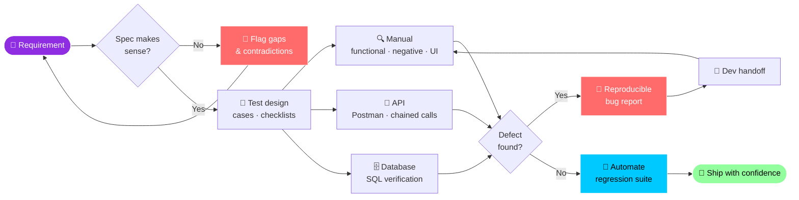

<div align="center">


<br>

<a href="https://github.com/NisaNajafli">
  
</a>
<a href="https://www.linkedin.com/in/nisa-najafli/">
  
</a>
<a href="mailto:najaflinisa@gmail.com">
  
</a>
<a href="https://wa.me/994555807384">
  
</a>


<br><br>


</div>

##  &nbsp;`whoami`

```yaml
name:     Nisa Najafli
role:     QA Engineer
domain:   Fintech · Investment platform · Microservices
stack:    Spring Boot · Camunda BPM · Oracle · Kafka
studying: MSc Artificial Intelligence @ ASOIU
origin:   Developer turned tester — I read the code, not just the screen
motto:    "It works on my machine" is not a test result
```

I test a **fintech investment platform** end to end — order lifecycles, BPMN workflows, securities, commissions, onboarding, maker-checker flows. Requirement analysis, test design, API and UI automation, and hunting the edge case everyone hoped nobody would try.

My **development background** is the unfair advantage: I can reproduce a defect, trace the likely cause, and hand a developer something actionable instead of a screenshot and a prayer.


##  &nbsp;Arsenal

<div align="center">


<br>


</div>

<table>
<tr>
<td width="33%" valign="top">

### 🤖 Automation


</td>
<td width="33%" valign="top">

### 🔌 API & Data


</td>
<td width="33%" valign="top">

### ⚙️ Process


</td>
</tr>
</table>


##  &nbsp;How a Feature Survives Me




##  &nbsp;What I Actually Deliver

| | |
| :-- | :-- |
| 🧪 **Test Design** | Test cases, scenarios, checklists, Xray-ready suites |
| 🕵️ **Manual Testing** | Functional · regression · smoke · exploratory · negative · UI/UX |
| 🔌 **API Testing** | REST validation, chained requests, pre-request & post-response scripts, environments |
| 🤖 **Automation** | Selenium (Java · TestNG · POM), Playwright, API automation suites |
| 🗄️ **Database** | SQL data verification, constraint & integrity checks |
| 📋 **Requirements** | Spec review, gap and contradiction analysis — *before* a single test is written |
| 🐞 **Reporting** | Reproducible bug reports, JQL-based Jira management, release quality reporting |


##  &nbsp;Principles

<div align="center">

| 🎯 | 💬 |
| :-: | :-- |
| **Break requirements, not builds** | A defect caught in the spec costs a conversation. In production it costs a release. |
| **A bug report is a deliverable** | Steps, expected, actual, environment, logs. No archaeology required. |
| **Automate what repeats** | Regression suites should run while people sleep. |
| **Two brains, every release** | Think like the user. Verify like an engineer. |

</div>


##  &nbsp;Currently

```diff
+ Deepening   → test automation architecture, CI-integrated suites
+ Studying    → MSc Artificial Intelligence (ASOIU) — neural networks thesis
+ Exploring   → AI-assisted test generation & quality analytics
! Always      → one more edge case
```


##  &nbsp;GitHub Stats

<div align="center">


<br>


<br>


</div>


<div align="center">

## 🧪 &nbsp;Test · Analyze · Improve · Repeat

**Open to QA opportunities, collaborations, and teams where quality is a requirement — not a phase.**

<a href="https://www.linkedin.com/in/nisa-najafli/">
  
</a>
<a href="mailto:najaflinisa@gmail.com">
  
</a>
<a href="tel:+994555807384">
  
</a>

<br>

<a href="https://www.linkedin.com/in/nisa-najafli/">
  
</a>


</div>
