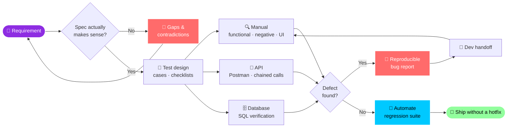
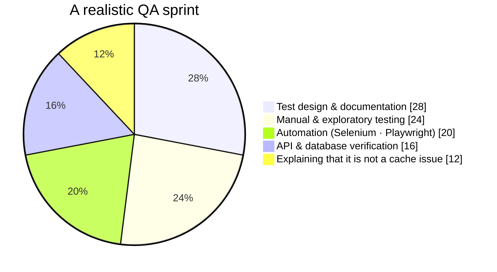
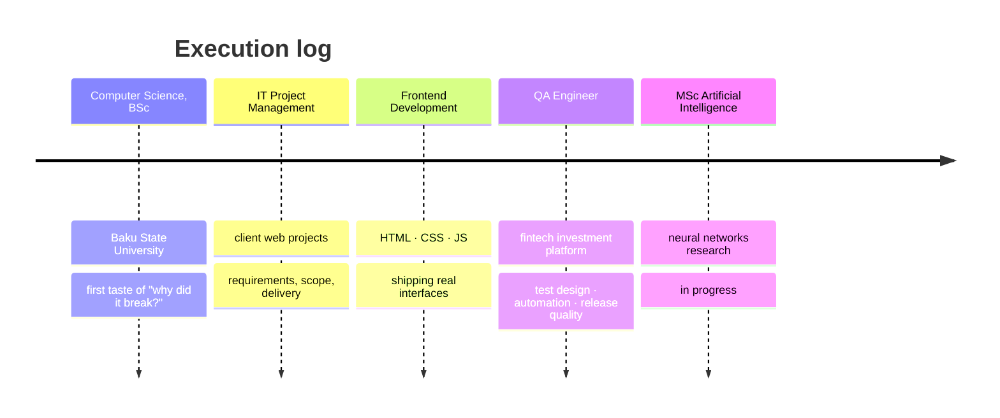

<div align="center">


<br>

<a href="https://github.com/NisaNajafli">
  
</a>
<a href="https://www.linkedin.com/in/nisa-najafli/">
  
</a>
<a href="mailto:najaflinisa@gmail.com">
  
</a>
<a href="https://wa.me/994555807384">
  
</a>

</div>


<div align="center">

### ⚡ &nbsp;`pipeline: nisa-najafli` &nbsp;·&nbsp; last run: today


<br>


</div>


## 💻 &nbsp;`$ whoami`

```console
$ nisa --whoami

  role       : QA Engineer
  domain     : Fintech · Investment platform · Microservices
  under_test : Spring Boot · Camunda BPM · Oracle · Kafka
  background : Developer turned tester — I read the code, not just the screen
  studying   : MSc Artificial Intelligence @ ASOIU
  location   : Baku, Azerbaijan (UTC+4)

$ nisa --philosophy

  "It works on my machine" is not a test result.
  The happy path is where testing starts, not where it ends.
```

I test a **fintech investment platform** end to end — order lifecycles, BPMN workflows, securities, commissions, onboarding, maker-checker flows. Requirement analysis, test design, API and UI automation, and hunting the edge case everyone hoped nobody would try.

My **development background** is the unfair advantage: I reproduce the defect, trace the likely cause, and hand the developer something actionable — not a screenshot and a prayer.


## 🥒 &nbsp;`hiring_nisa.feature`

```gherkin
Feature: Hiring Nisa Najafli
  As a team that ships to real users
  I want a QA engineer who reads specs like a lawyer
  So that our customers never become our test environment

  Background:
    Given a platform built from microservices
    And requirements that quietly contradict each other on page 4

  Scenario: A release goes out
    Given the specification was reviewed before test design started
    When 3 gaps and 2 contradictions are flagged
    Then they are fixed before a single test case is written
    And the regression suite runs overnight, unsupervised
    And the release ships without a hotfix

  Scenario Outline: The cases nobody wanted to think about
    When the input is "<input>"
    Then the system must not <disaster>

    Examples:
      | input                 | disaster           |
      | amount = 0.00         | crash              |
      | 10-digit order value  | silently round      |
      | expired token         | leak data          |
      | double-clicked submit | charge twice       |
      | back button mid-flow  | duplicate a record |
```


## 🧰 &nbsp;Arsenal

<div align="center">


<br>


</div>

<table>
<tr>
<td width="33%" valign="top">

### 🤖 Automation


</td>
<td width="33%" valign="top">

### 🔌 API & Data


</td>
<td width="33%" valign="top">

### ⚙️ Process


</td>
</tr>
</table>


## 🔄 &nbsp;How a Feature Survives Me




## 📊 &nbsp;Where the Week Actually Goes




## 🗓 &nbsp;Career Test Run — *all green so far*




## 📂 &nbsp;Evidence — *tap to expand*

<details>
<summary><b>&nbsp;🐞 &nbsp;What a bug report from me looks like</b></summary>

<br>

> **ID:** INV-2481 &nbsp;·&nbsp; **Severity:** High &nbsp;·&nbsp; **Priority:** P1 &nbsp;·&nbsp; **Module:** Order Management

**Summary:** Cancelling an order in `PENDING_APPROVAL` leaves the reserved balance locked

**Environment:** Test env · Chrome 126 · build 2.14.3 · Oracle 19c

**Preconditions:** Customer has an active investment account with sufficient balance

**Steps to reproduce**
1. Create a buy order that requires approval
2. Verify the reserved amount appears under Account Balance
3. Cancel the order from the order list before the approver acts
4. Refresh Account Balance

**Expected:** Reserved amount is released and available balance returns to its original value
**Actual:** Order status becomes `CANCELLED`, but the reserved amount stays locked

**Evidence:** API response · DB query result · workflow instance state · screen recording

**Impact:** Customer funds are unavailable until manual intervention

</details>

<details>
<summary><b>&nbsp;🧪 &nbsp;What a test case from me looks like</b></summary>

<br>

| Field | Value |
| :-- | :-- |
| **ID** | TC-ORD-047 |
| **Title** | Reject an order with an amount above the customer limit |
| **Type** | Functional · Negative |
| **Preconditions** | Customer limit configured; account funded |
| **Steps** | 1. Open order creation · 2. Enter amount = limit + 0.01 · 3. Submit |
| **Expected** | Order is rejected, validation message displayed, no workflow instance created, no balance reserved |
| **Postconditions** | Account balance unchanged |
| **Automation** | Covered in regression suite |

</details>

<details>
<summary><b>&nbsp;🔌 &nbsp;How I approach API testing</b></summary>

<br>

- **Contract first** — status codes, schema, required fields, data types
- **Chained scenarios** — auth → create → read → update → cancel, with variables carried between requests
- **Scripted validation** — pre-request setup and post-response assertions in JavaScript
- **Environments** — no hardcoded URLs, tokens, or IDs. Ever.
- **Negative coverage** — expired tokens, missing fields, wrong types, boundary values, concurrent calls
- **Cross-layer verification** — API says success, so the database and the workflow engine had better agree

</details>

<details>
<summary><b>&nbsp;💡 &nbsp;Principles I actually work by</b></summary>

<br>

- **Break requirements, not builds.** A defect caught in the spec costs a conversation. In production it costs a release.
- **A bug report is a deliverable.** Steps, expected, actual, environment, evidence. No archaeology required.
- **Automate what repeats.** Regression suites should run while people sleep.
- **Every state is a real state.** Loading, empty, error, timeout, offline — not just success.
- **Two brains, every release.** Think like the user. Verify like an engineer.

</details>


## 🆕 &nbsp;Release Notes

```diff
@@ v3.0 — Current @@
+ QA on a fintech investment platform: orders, trades, securities, commissions, onboarding
+ Selenium (Java · TestNG · POM) and Playwright automation
+ API automation suites with chained requests and scripted assertions
+ Spec review that catches contradictions before test design
! In progress: automation architecture, CI-integrated suites, AI-assisted test generation

@@ v2.0 — Development Era @@
+ Frontend development and production web projects
+ IT project management: requirements, scope, delivery

@@ v1.0 — Origin @@
+ BSc Computer Science
+ First "why did it break?" — still unanswered, still investigating
```


## 📈 &nbsp;GitHub Stats

<div align="center">


<br>


<br>


<br>


</div>


<div align="center">

## 🧪 &nbsp;Test · Analyze · Improve · Repeat

**Open to QA opportunities, collaborations, and teams where quality is a requirement — not a phase.**

<a href="https://www.linkedin.com/in/nisa-najafli/">
  
</a>
<a href="mailto:najaflinisa@gmail.com">
  
</a>
<a href="https://wa.me/994555807384">
  
</a>
<a href="https://github.com/NisaNajafli">
  
</a>

<br><br>


</div>
